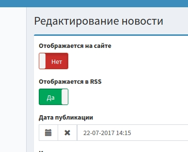

yii2-bootstrap-toggle
===========

Yii2 extension to render bootstrap toggle widget instead of checkbox.



[http://www.bootstraptoggle.com/](http://www.bootstraptoggle.com/)


## Installation

The preferred way to install this extension is through [composer](https://getcomposer.org/download/).

Either run

```
$ php composer.phar require dbfernandes/yii2-icomp-toggle dev-master
```

or add

```
"dbfernandes/yii2-icomp-toggle": "dev-master"
```

to the ```require``` section of your `composer.json` file.

## Usage

### In active form
```php
use dbfernandes\icomp\ICompToggleWidget;

//...
echo $form->field($model, 'attribute')->widget(ICompToggleWidget::className());
//...
```

### Standalone widget

```php
use dbfernandes\icomp\ICompToggleWidget;

//...
IcompToggleWidget::widget([
    'name' => 'is_enabled',
    'value' => false,
]);
//...
```

## Options

```php
ICompToggleWidget::widget([

    /**
     * Wrapper tag name. If set to false no tag will be rendered
     */
    'container' => 'div',

    /**
     * Wrapper HTML attributes
     */
    'containerOptions' => [],
    
    /**
     * Label when checkbox is checked
     */
    'labelEnabled' => 'Yes',
    
    /**
     * Label when checkbox is not checked
     */
     'labelDisabled' => 'No',
     
     /**
      * Additional javascript options to Bootstrap Toggle plugin 
      */
      'pluginOptions' => [],
]);
```
